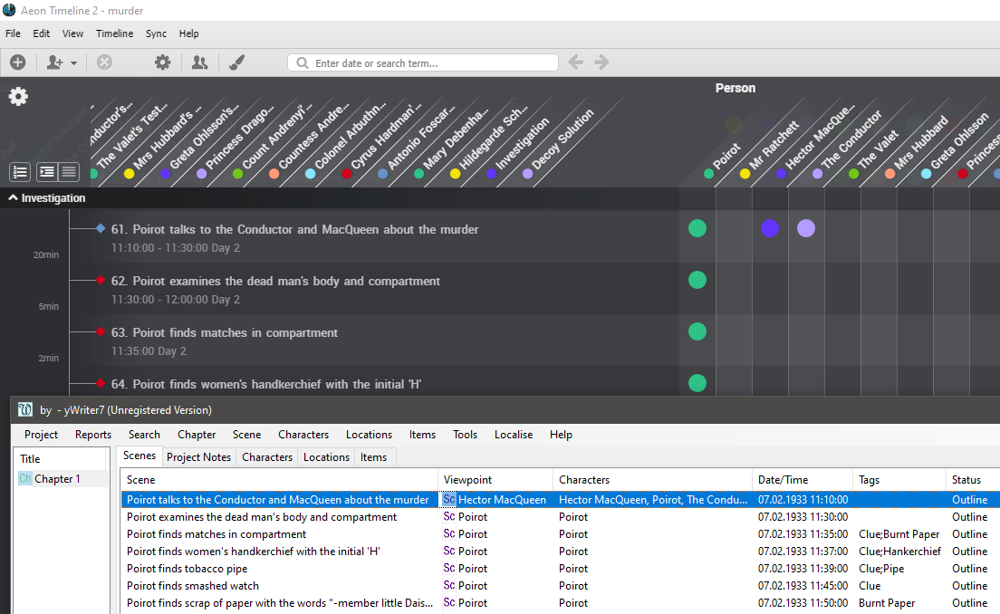

# aeon2yw

[yWriter](http://spacejock.com/yWriter7.html) is a free word processor written by Australian author and programmer Simon Haynes. yWriter's strengths are structuring novels and controlling the progress during the writing process. With the *aeon2yw* Python script, you can convert a novel outline created with Aeon Timeline 2 into a new yWriter project.

The application is ready for internationalization with GNU gettext. A German localization is provided. 

## Features

### Create a new yWriter project from a timeline

- The release comes with a template for Aeon Timeline 2 that provides characters, locations and items, as well as yWriter's scene properties such as description and notes.
- Events assigned to the *Narrative* arc are considered scenes.
- The aeon2yw Python script converts Aeon's *.aeonzip* project file into a new yWriter project.
- Scene date, time, and duration are imported, if the year is between 100 and 9999.
- Scene characters, locations, items, relationships, descriptions, notes, and tags are imported.

### Update an existing yWriter project from a timeline

- Update scene date, time, duration, description, tags, and relationships.
- Missing scenes, characters, locations, and items are created.
- Scenes are marked "unused" if the associated event is deleted in Aeon.

### Update an existing timeline from a yWriter project

- Update event date, time, duration, description, tags, and relationships.
- Entity types "Arc", "Character", "Location", and "Item", and a *Narrative* arc are created, if missing.
- Event properties "Description" and "Notes" are created, if missing.
- Missing events, characters, locations, and items are created.
- "Narrative" events are removed if the associated scene is deleted in yWriter.

### Create a new timeline from a yWriter project

- Just update an empty timeline from a yWriter project.

 
## Requirements

- Windows.
- [Python](https://www.python.org/) version 3.6+.
- [yWriter](http://spacejock.com/yWriter7.html).
- Aeon Timeline 2. Note: There is now a separate [converter for Aeon Timeline 3](https://peter88213.github.io/aeon3yw). 

## Download and install

[Download the latest release (version 3.4.2)](https://raw.githubusercontent.com/peter88213/aeon2yw/main/dist/aeon2yw_v3.4.2.zip)

- Extract the "aeon2yw_v3.4.2" folder from the downloaded zipfile "aeon2yw_v3.4.2.zip".
- Move into this new folder and launch **setup.pyw**. This installs the script for the local user.
- Create a shortcut on the desktop when asked.
- Open "README.md" for further instructions.

### Note for Linux users

Please make sure that your Python3 installation has the *tkinter* module. On Ubuntu, for example, it is not available out of the box and must be installed via a separate package. 

------------------------------------------------------------------

[Changelog](changelog)

## Usage

- [Instructions for use](usage)
- [Tutorial](tutorial)

## See also

There is a [plugin](https://peter88213.github.io/novelyst_aeon2/) for the [novelyst](https://peter88213.github.io/novelyst/) application.

## Credits

- The icons are made using the free *Pusab* font by Ryoichi Tsunekawa, [Flat-it](http://flat-it.com/).
- Frederik Lundh published the [xml pretty print algorithm](http://effbot.org/zone/element-lib.htm#prettyprint).

## License

aeon2yw is distributed under the [MIT License](http://www.opensource.org/licenses/mit-license.php).

 

