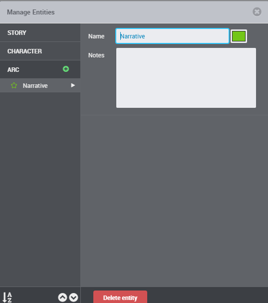
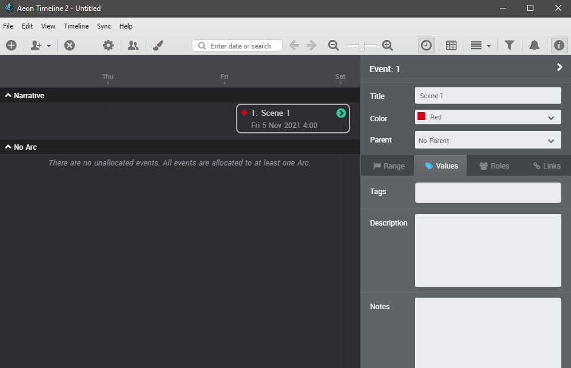

[Project home page](index) > Tutorial

------------------------------------------------------------------

## Set up a new timeline for yWriter export

The included installation script installs a "yWriter" template in the Aeon 2 configuration folder. 
The easiest way is to create new timelines based on this template. It provides the entities and event properties that are converted to yWriter by default.

When creating a new timeline with Aeon Timeline 2, choose the *yWriter* template in the *Custom Templates* section. 

## Set up an existing timeline for yWriter export

For existing timelines you have two choices:

### Option 1: Modify your Timeline Settings

#### Mandatory Timeline settings

Make sure there is an arc called "Narrative". You can mark any event as a scene by assigning it to this arc.

#### Optional Timeline settings

Event properties named "Description" and "Notes" of the "Multi-line Text" type are converted to yWriter scene descriptions and scene notes.

You can rename existing entity types to match yWriter's naming conventions.

Important: "Participants" are exported to yWriter as scene characters.

Entities named "Location" and "Item" are converted to yWriter locations and items.

The "Location" and "Item" entity types have one role with the same name; Multiple per event is allowed.

 

### Option 2: Customize the *aeon2yw* configuration to fit your timeline.

If you do not want to modify your existing timeline, you can change the *aeon2yw* configuration instead 
by adding an *aeon2yw.ini* file to your timeline project folder.

See the [instructions for use](usage#custom-configuration)

## Add entities to your timeline

Depending on your timeline setup, you can now specify characters, locations and items.

## Edit events in the Inspector

If you assign an event to the "Narrative" arc, the event is exported as a regular scene to yWriter.

Depending on your timeline setup, you can now enter descriptions and notes to your events via the "Values" tab.

Characters, locations and items can be added to the events via the "Roles" tab.

Pre-defined entities can be selected via a dropdown menu.

## Create a new yWriter project from a timeline

Launch the converter by dragging the *.aeonzip* file and dropping it on the "aeon2yw" shortcut icon. 

If everything goes right, you will now find a new yWriter 7 project file in your folder. Open it by double-clicking on the icon.

## Update an existing yWriter project

If a yWriter project with the same name already exists, you can update the scene dates and durations from the timeline. Launch the converter by dragging the *.aeonzip* file and dropping it on the "aeon2yw" shortcut icon as shown above. 

## Synchronize the timeline

If a yWriter project with the same name exists, you can update the scene dates and durations from the yWriter project. Events are created from new scenes. Launch the converter by dragging the *.yw7* file and dropping it on the "aeon2yw" shortcut icon. 

## Create a new timeline from a yWriter project

- First create a new timeline in the yWriter project folder with the same name as the yWriter project. Preferably use the supplied "yWriter" template. Add a "Narrative" arc.
- Then synchronize this timeline with your yWriter project as described above.
    