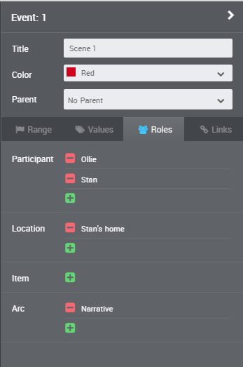

[Project home page](index) > Tutorial

------------------------------------------------------------------

## Set up a new timeline for yWriter export

The included installation script installs a "yWriter" template in the Aeon 2 configuration folder. 
The easiest way is to create new timelines based on this template. It provides the entities and event properties that are converted to yWriter by default.

When creating a new timeline with Aeon Timeline 2, choose the *yWriter* template in the *Custom Templates* section. 

## Set up an existing timeline for yWriter export

For existing timelines you have two choices:

### Option 1: Modify your Timeline Settings

#### Mandatory Timeline settings

Create a new event property named "Scene". It is of the "Yes / No" type, so you get a checkbox where you can mark an event as a scene.

#### Optional Timeline settings

Event properties named "Description" and "Notes" of the "Multi-line Text" type are converted to yWriter scene descriptions and scene notes.

You can rename existing entity types to match yWriter's naming conventions.

Important: "Participants" are exported to yWriter as scene characters.

If you wish to set the viewpoint, you can add a "Viewpoint" role (do not allow multiple per event).

Entities named "Location" and "Item" are converted to yWriter locations and items.

The "Location" and "Item" entity types have one role with the same name; Multiple per event is allowed.

 

### Option 2: Customize the *aeon2yw* configuration to fit your timeline.

If you do not want to modify your existing timeline, you can change the *aeon2yw* configuration instead 
by adding an *aeon2yw.ini* file to your timeline project folder.

See the [instructions for use](usage#custom-configuration)

## Add entities to your timeline

Depending on your timeline setup, you can now specify characters, locations and items.

## Edit events in the Inspector

Depending on your timeline setup, you can now enter descriptions and notes to your events via the "Values" tab.

If you tick the "Scene" checkbox, the event is exported as a regular scene to yWriter.

Characters, locations and items can be added to the events via the "Roles" tab.

Pre-defined entities can be selected via a dropdown menu.

Same to the viewpoint. It makes no difference whether the viewpoint character is listed as a "Participant" or not.

## CSV export from Aeon Timeline 2

- The csv file must be **comma**-separated.
- Date format is like **1940-11-27**.
- Time format is like **17:43**.

## Create a new yWriter project

Now launch the converter by dragging the csv file and dropping it on the "aeon2yw" shortcut icon. 

If everything goes right, you will now find a new yWriter 7 project file in your folder. Open it by double-clicking on the icon.

    