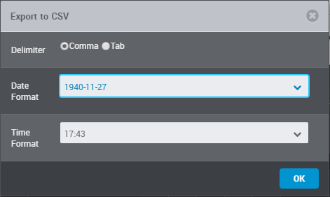

[Project homepage](https://peter88213.github.io/aeon2yw)

------------------------------------------------------------------

The aeon2yw Python script creates a yWriter 7 project from a csv file exported by Aeon Timeline 2.

## Instructions for use

### Intended usage

The included installation script creates a shortcut on the desktop. You can launch the program by dragging a csv file and dropping it on the shortcut icon. 

### Command line usage

Alternatively, you can

- launch the program on the command line passing the yWriter project file as an argument, or
- launch the program via a batch file.

usage: `aeon2yw.pyw [--silent] Sourcefile`

#### positional arguments:

`Sourcefile` 

The path of the Aeon Timeline 2 csv export file.

#### optional arguments:

`--silent`  suppress error messages and the request to confirm overwriting

## csv export from Aeon Timeline 2

- The csv file exported by Aeon Timeline 2 must be **comma**-separated.
- Date format is like **1940-11-27**.
- Time format is like **17:43**.

## Conversion rules

The column labels refer to the example timeline "Murder on the Orient Express". 

-   All events tagged as "Scene" (case sensitive) are converted to regular scenes.
-   All events not tagged as "Scene" are converted to "Notes" scenes.
-   All scenes are placed in a single chapter.
-   All scenes are sorted chronologically (Note: "BC" is not evaluated). 
-   The scene status is "Outline". 
-	The event title is used as scene title.
- 	The start date is used as scene date/time.
-	Duration and end date are not used.
-   "Descriptions" are used as scene descriptions, if any.
-   "Notes" are used as scene notes, if any.
-	"Arcs" are converted to scene tags, if any.
-	"Participants" are imported as characters, if any.
-	"Locations" are imported, if any.
-	"Items" are imported, if any.

## Installation path

The **install.bat** installation script installs *aeon2yw.pyw* in the user profile. This is the installation path: 

`c:\Users\<user name>\AppData\Roaming\PyWriter\aeon2yw`
    